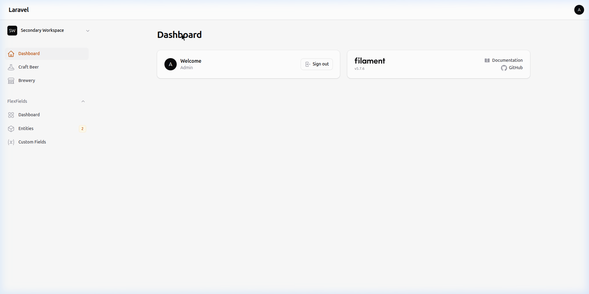
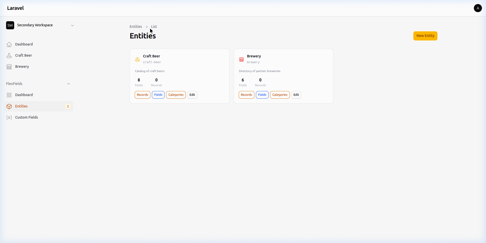
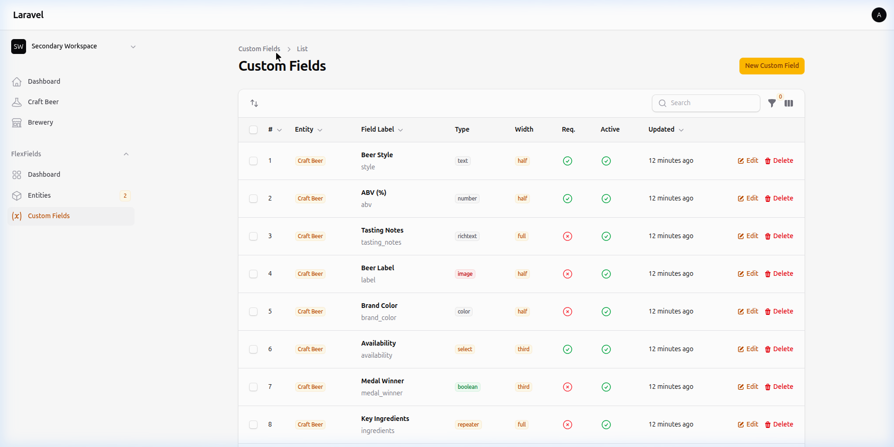
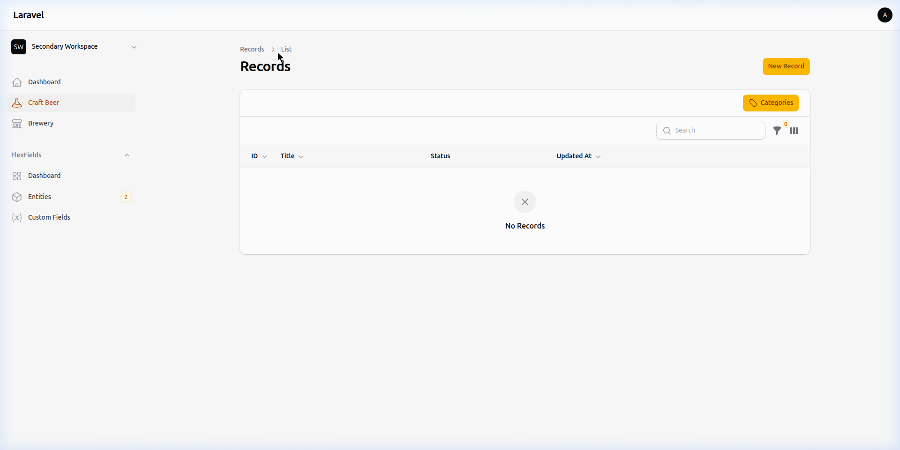
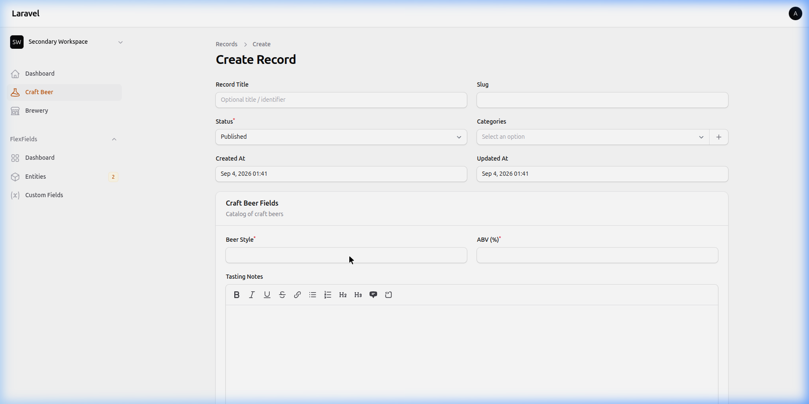

# FlexFields — Dynamic Entities & Custom Fields for Filament

[](https://packagist.org/packages/ivanmercedes/flex-fields)
[](https://packagist.org/packages/ivanmercedes/flex-fields)
[](https://packagist.org/packages/ivanmercedes/flex-fields)
[](https://packagist.org/packages/ivanmercedes/flex-fields)
[](https://github.com/ivanmercedes/flex-fields/actions/workflows/laravel-pint.yml)


**FlexFields** brings the power of dynamic schemas to Laravel and the [Filament](https://filamentphp.com) admin panel. Think of it as **Advanced Custom Fields (ACF)** adapted to the Filament ecosystem. It allows you to create Custom Entities (like post types: "Products", "Employees", "Events") and attach customizable fields to them on the fly—without having to modify your database schema every time.

---

## Features

- **Custom Entities:** Define any data structure (like post types) without touching database migrations.
- **17+ Custom Field Types:** Support for text, textarea, number, email, URL, date, datetime, boolean/toggle, select, multiselect, color, file, image, rich text, JSON, tags, and dynamic repeaters.
- **`HasFlexFields` Eloquent Trait:** Attach dynamic flex fields directly to any existing model (`Product`, `User`, etc.).
- **`FlexFields` Facade:** Fluent global access: `FlexFields::entity('product')->records()`, `createRecord()`, `status()`, `clearCache()`.
- **Field Caching:** High-performance active field caching with automatic invalidation on save/delete.
- **Form Builder Macros:** Register custom field component handlers via `DynamicFormBuilder::macro(...)`.
- **`flex:status` Artisan Command:** Display entity, field, record, multi-tenancy, and cache configuration overview in the terminal.
- **Multi-Tenancy Support:** Full compatibility with Filament's multi-tenancy system, allowing scoped entities, fields, and records per tenant.
- **Dynamic Forms & Tables:** Forms for each entity are generated automatically from its field definitions. Tables are populated dynamically with fields marked as "Show in list".
- **Drag-and-Drop Reordering:** Easily rearrange custom fields within an entity.
- **Entity Categories:** Create hierarchical categories and subcategories per entity, and categorize your records easily.
- **EAV Storage:** Robust and scalable Entity-Attribute-Value storage pattern natively adapted for Eloquent.
- **Built-in Dashboard & Widget:** Visual overview of all entities, fields, and records, plus an embeddable stats widget.

---

## See it in Action

### 1. The Global Dashboard
Visual overview of all your dynamic entities and custom fields.


### 2. Entity Management
Define your custom data types (like "Craft Beer" or "Brewery").


### 3. Custom Fields Builder
Easily add, configure, and reorder fields for each entity.


### 4. Dynamic Forms & Records
Create entries using beautiful, dynamically generated forms powered by Filament.




---

## Requirements

- PHP 8.3 or higher
- Filament 4.x / 5.x

---

## Installation

You can install the package via composer:

```bash
composer require ivanmercedes/flex-fields
```

After requiring the package, run the installation command. This will publish the necessary migrations and configuration files:

```bash
php artisan flex-fields:install
```

Then, run the migrations:

```bash
php artisan migrate
```

### Register the Plugin

Add the `FlexFieldsPlugin` to your Filament panel configuration (usually inside `app/Providers/Filament/AdminPanelProvider.php`):

```php
use IvanMercedes\FlexFields\FlexFieldsPlugin;

public function panel(Panel $panel): Panel
{
    return $panel
        // ...
        ->plugins([
            FlexFieldsPlugin::make()
                ->showDashboardPage(true)
                ->showOverviewWidget(true)
                ->showEntitiesInMenu(true), // Globally toggle entities in the sidebar
        ]);
}
```

---

## How It Works

### Entities
An **Entity** represents a custom data type. For example: `Product` (slug: `product`), `Employee`, or `Event`. Each entity manages its own isolated form, with records seamlessly stored in a shared `ff_entity_records` table.

### Custom Fields
A **Custom Field** is attached to an Entity. It defines the type of data, a unique machine-readable key (auto-generated from the label), layout formatting (order, width), and behavior toggles (searchable, required, shown in list).

### Entity Categories
Entities support isolated **Categories and Subcategories**. You can build hierarchical taxonomies specific to an entity and assign them dynamically to your records.

### Entity Records
When adding records to an entity, the form elements and structure are dynamically built via the Filament form builder using the definitions from your custom fields. All input is securely stored using the EAV pattern in `ff_field_values`.

---

## Schema Builder (Code-First Entities)

FlexFields includes a Schema Builder that allows you to define your Entities and Custom Fields programmatically, similar to Laravel migrations.

```bash
php artisan flex:make-schema Product
php artisan flex:migrate
php artisan flex:rollback
```

For full details, read the [Schema Builder Documentation](docs/schema-builder.md).

---

## Developer Experience & Facade Usage

### `FlexFields` Facade
```php
use IvanMercedes\FlexFields\Facades\FlexFields;

// Fluent entity access
$entity = FlexFields::entity('product');
$fields = $entity->fields(); // Cached active fields
$records = $entity->records()->where('status', 'published')->get();

// Create record with field values
$record = $entity->createRecord([
    'title' => 'Sample Product',
], [
    'price' => 99.99,
    'color' => '#00ff00',
]);
```

### `HasFlexFields` Trait
Attach flex fields directly to any model:

```php
use Illuminate\Database\Eloquent\Model;
use IvanMercedes\FlexFields\Models\Traits\HasFlexFields;

class Product extends Model
{
    use HasFlexFields;
}

$product = Product::find(1);
$product->setFlexValue('price', 199.99);
$price = $product->getFlexValue('price');
```

### System Status Command
```bash
php artisan flex:status
```

For full details, read the [Facade & Developer Experience Documentation](docs/facade_usage.md).

---

## Customizing

### Manage Config Settings

To customize the default settings, publish the configuration file to your project:

```bash
php artisan vendor:publish --tag="flex-fields-config"
```

In `config/flex-fields.php`, you can configure Multi-Tenancy, Field Caching, Upload path patterns, and more:

```php
return [
    'tenancy' => [
        'enabled' => true,
        'tenant_model' => App\Models\Team::class,
        'tenant_column' => 'tenant_id',
    ],

    'cache' => [
        'enabled' => true,
        'ttl' => 86400,
    ],
    
    'navigation_group' => 'Content',
];
```

---

## Navigation Structure overview

By default, the plugin registers the following navigation resources under the `FlexFields` group:

```text
FlexFields (group)
├── Dashboard       → Overview of all active entities and stats
├── Entities        → Create, config, and manage entity types
├── Custom Fields   → Manage fields logically grouped per entity
└── Entity Data     → Add or edit entries/records for your entities
```

---

## Database Architecture

- **`ff_entities`**: Defines the "type" of the data grouping (e.g., Products, Services).
- **`ff_custom_fields`**: Serves as the "columns/attributes" logic mapped to an entity.
- **`ff_entity_categories`**: Stores hierarchical categories specifically scoped to an entity.
- **`ff_entity_records`**: A master identifier that holds one row per recorded entry.
- **`ff_entity_record_category`**: Pivot table mapping records to their assigned categories.
- **`ff_field_values`**: Holds the individual data values mapped. Effectively one row per (record × field) pair.

---

## Roadmap

Curious about what's coming next? Check out the [ROADMAP.md](ROADMAP.md) for planned features and upcoming versions.

---

## License

The MIT License (MIT). Please see [License File](LICENSE) for more information.
